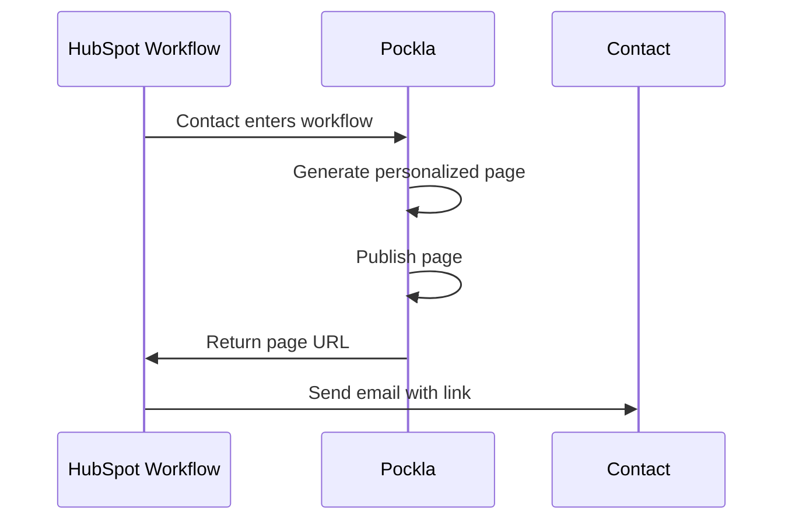

Workflow integration connects Pockla to your HubSpot workflows. When a contact enters a workflow with the Pockla action, a personalized page is automatically generated and published—no manual steps required.

{/* TODO: Video - Complete workflow integration setup (90-120 seconds) */}
<Frame caption="Video: Complete workflow integration setup (90-120 seconds)">
  

    [Video placeholder]
  

</Frame>

## When to Use This

- **Automated sequences** – Every new lead gets a personalized page automatically
- **Trigger-based personalization** – Pages generated when contacts hit specific criteria
- **Always-on campaigns** – Continuous page generation as contacts flow through your CRM
- **Real-time personalization** – Pages created the moment a contact qualifies

## How It Works

1. Contact enters your HubSpot workflow
2. Workflow triggers the "Generate Pockla Link" action
3. Pockla generates a personalized page using CRM contact data
4. Page is automatically published
5. URL is returned to HubSpot (can be used in subsequent workflow actions)

## Setting Up Workflow Integration

<Steps>
  <Step title="Connect HubSpot">
    If you haven't already, connect your HubSpot account in **Settings → Integrations → HubSpot**.
    
    {/* TODO: Screenshot - HubSpot connection in Settings */}
<Frame caption="Screenshot: HubSpot connection in Settings">
  

    [Screenshot placeholder]
  

</Frame>

    
  </Step>
  
  <Step title="Create a Workflow Link Set">
    From your dashboard, click **Connect to Workflow** (under Quick Actions).
    
    Enter a name for your workflow (e.g., "New Lead Welcome Pages"). This name appears in HubSpot's action dropdown.
    
    {/* TODO: Screenshot - Connect to Workflow option and naming modal */}
<Frame caption="Screenshot: Connect to Workflow option and naming modal">
  

    [Screenshot placeholder]
  

</Frame>

    
  </Step>
  
  <Step title="Send a Test Contact">
    Pockla waits for HubSpot to send a test contact:
    
    1. In HubSpot, open your workflow
    2. Add the **"Generate Pockla Link"** action
    3. Select your workflow name from the dropdown
    4. Click **"Test action"** and choose a contact
    
    {/* TODO: Screenshot - HubSpot workflow editor with Pockla action */}
<Frame caption="Screenshot: HubSpot workflow editor with Pockla action">
  

    [Screenshot placeholder]
  

</Frame>

    
    
    Pockla detects the test contact automatically.
    
    {/* TODO: Screenshot - Pockla waiting for test contact */}
<Frame caption="Screenshot: Pockla waiting for test contact">
  

    [Screenshot placeholder]
  

</Frame>

    
  </Step>
  
  <Step title="Configure Your Page">
    Once the test contact arrives, you're taken to the page configuration screen.
    
    - Enter the URL to personalize
    - Use AI chat to configure elements
    - Preview with the test contact's data
    
    {/* TODO: Screenshot - Workflow configuration with test contact data */}
<Frame caption="Screenshot: Workflow configuration with test contact data">
  

    [Screenshot placeholder]
  

</Frame>

    
  </Step>
  
  <Step title="Activate">
    Click **Activate** to save your configuration. The workflow is now ready—any contact entering will get a personalized page.
    
    {/* TODO: Screenshot - Workflow activation confirmation */}
<Frame caption="Screenshot: Workflow activation confirmation">
  

    [Screenshot placeholder]
  

</Frame>

    
  </Step>
</Steps>

## Workflow vs. Running for Contacts

| Aspect | Running for Contacts | Workflow Integration |
|--------|---------------------|---------------------|
| **Trigger** | Manual (you click Generate) | Automatic (workflow trigger) |
| **Contact source** | Pockla database | HubSpot CRM |
| **Enrichments** | Available | Not available* |
| **Best for** | Campaigns, defined lists | Automated sequences |
| **Volume** | Any number at once | One at a time, continuously |

*Workflow contacts come directly from HubSpot and don't have Pockla enrichments. You can still use all HubSpot contact properties.

## Available Contact Data

In workflow mode, you can use any HubSpot contact property in your prompts:

| Variable | HubSpot Property |
|----------|------------------|
| `{{firstName}}` | First name |
| `{{lastName}}` | Last name |
| `{{email}}` | Email |
| `{{company}}` | Company name |
| `{{jobTitle}}` | Job title |
| `{{phone}}` | Phone number |

<Note>
Custom HubSpot properties aren't currently supported in prompts. Standard properties work out of the box.
</Note>

## Using the Generated URL in HubSpot

After Pockla generates the page, the URL is available in HubSpot for use in:

- **Email actions** – Include the personalized link in follow-up emails
- **Task creation** – Add the link to sales tasks
- **Property updates** – Store the URL on the contact record

**Example workflow:**
1. Contact submits form → enters workflow
2. Generate Pockla Link action runs
3. Delay 1 hour
4. Send email with personalized page link

{/* TODO: Screenshot - HubSpot workflow using Pockla URL in email action */}
<Frame caption="Screenshot: HubSpot workflow using Pockla URL in email action">
  

    [Screenshot placeholder]
  

</Frame>

## Monitoring Workflow Activity

View workflow-generated pages in your Link Set's instances view. They're marked with a "workflow" badge and show:

- Contact name and company (from HubSpot)
- Generation timestamp
- Published URL
- Status (published, failed)

{/* TODO: Screenshot - Instances view with workflow-generated pages */}
<Frame caption="Screenshot: Instances view with workflow-generated pages">
  

    [Screenshot placeholder]
  

</Frame>

## Troubleshooting

<AccordionGroup>
  <Accordion title="Workflow not appearing in HubSpot">
    - Ensure HubSpot is connected in Pockla settings
    - Check that you completed the workflow creation flow
    - Refresh HubSpot's workflow editor
  </Accordion>
  
  <Accordion title="Test contact not detected">
    - Make sure you selected the correct workflow name in HubSpot
    - Check that the test action completed successfully
    - Try sending a different test contact
  </Accordion>
  
  <Accordion title="Pages failing to generate">
    - Verify the source URL is accessible
    - Check that contact has required properties (name, company)
    - Review error messages in the instances view
  </Accordion>
  
  <Accordion title="URL not appearing in HubSpot">
    - Generation may still be in progress
    - Check Pockla for errors on that instance
    - Ensure the workflow action completed without errors
  </Accordion>
</AccordionGroup>

## Best Practices

<AccordionGroup>
  <Accordion title="Test thoroughly before going live">
    Use HubSpot's test action to verify pages generate correctly. Check several contacts with different data to ensure prompts handle edge cases.
  </Accordion>
  
  <Accordion title="Keep prompts simple">
    Workflow contacts have less data than enriched Pockla contacts. Write prompts that work well with just basic contact info (name, company, title).
  </Accordion>
  
  <Accordion title="Add delays before emails">
    Page generation takes a few seconds. If your workflow sends an immediate email with the link, add a short delay to ensure the page is ready.
  </Accordion>
  
  <Accordion title="Monitor the instances view">
    Periodically check your workflow Link Set's instances to catch failures. A high failure rate might indicate a prompt issue or missing data.
  </Accordion>
</AccordionGroup>

## Next Steps

<CardGroup cols={2}>
  <Card title="HubSpot Setup" icon="hubspot" href="/integrations/hubspot/overview">
    Detailed HubSpot integration guide
  </Card>
  <Card title="Running for Contacts" icon="users" href="/links/running-for-contacts">
    Generate pages for a specific list
  </Card>
</CardGroup>
